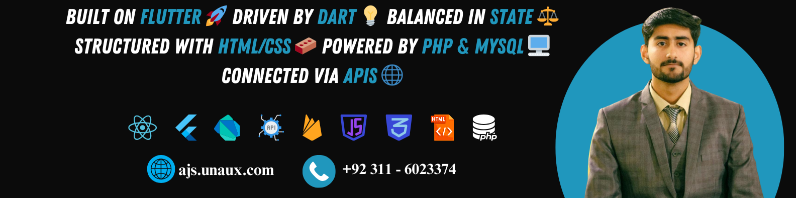

  

  

  

  

<h1 align="center">Hi 👋, I'm <strong>Muhammad Assad Ullah</strong></h1>

<h3 align="center">Professional <strong>Flutter App Developer</strong> | 3+ Years Experience | Building Mobile Solutions from Pakistan</h3>

- 🚀 Professional Flutter developer with <strong>3+ years of experience</strong> delivering production-ready mobile applications
- 🔭 Currently working on <strong>AI Student Assistant</strong>, <strong>Budget App</strong>, and <strong>AI Pocket Lawyer</strong>
- 🌱 Specializing in <strong>advanced state management (Provider, Riverpod, GetX)</strong> and <strong>clean architecture patterns (MVVM, MVC)</strong>
- 👯 Open to collaborate on <strong>Flutter projects</strong> for startups, research teams, and enterprise solutions
- 💬 Expert in <strong>Flutter, Dart, Firebase, REST APIs, Mobile App Architecture, and Cross-Platform Development</strong>
- 👨‍💻 Portfolio: <a href="https://assassinaj602.github.io/assassinaj602/">GitHub Pages Portfolio</a>
- 📫 Reach me: <strong>asadullahaj602@gmail.com</strong>

## 🚀 Featured Projects

> Tip: Update links below to your public repos when ready. You can also surface them visually in the portfolio at `docs/` via GitHub Pages.

- **AI Student Assistant** - Cross-platform study companion with AI chat, AI flashcards, timetable, notes with summarization, Firebase Auth, PWA.
- **Budget App** - Personal finance tracker with charts (fl_chart), categories, CSV export, theming, and Hive persistence.
- **UET Calculator** - Merit, GPA, and CGPA calculators with UET-specific weightages and responsive UI.
- **Shopping Cart App** - M3 dark theme, Provider state, SQLite persistence, smooth product browsing.
- **GameVerse** - Game library, wishlists, reviews; Provider state, animations, SharedPreferences storage.

## 🧪 Languages and Tools

  
  
  
  
  
  
  
  

## 📈 Live Progress

These sections auto‑update to reflect your ongoing GitHub activity and contributions. No manual edits needed after setup.

### Contribution Graph

  

### Stats & Streak

## 💼 Experience

- **Freelancer.com - Professional Freelancer** (Remote) — Flutter & Web Developer — Apr 2025 - Present
  - Delivered cross-platform mobile and web apps using Flutter & Dart for international clients
  - Integrated REST APIs, AI LLMs (OpenRouter/DeepSeek), and Firebase for real-time features and auth
  - Implemented Provider & Riverpod for state management; used SQLite & Hive for offline-first UX
  - Followed Clean Architecture & MVVM for scalable, maintainable, and testable code

- **Excelerate - Flutter Intern** (Remote) — Software Engineer Intern — Sep 2025 - Oct 2025
  - Contributed to production-ready Flutter apps with robust UI and API integrations
  - Assisted with AI-based features, Firebase backend (Auth/Firestore), and REST communication
  - Collaborated on code reviews, debugging, and feature delivery following industry best practices

- **Softdesk - AI & Flutter Mentorship Program** (Remote) — Technical Mentor — Jan 2025 - Apr 2025
  - Mentored junior developers in Flutter, Dart, Firebase, and AI integrations to build full-stack mobile apps
  - Helped 20+ students ship real-world projects (AI chat apps, CRUD apps, mini-games)

- **UET Taxila - BSc Computer Science** — Aug 2023 - May 2027 — GPA 3.56/4.0
- **MLSA UET Taxila - Marketing Team** — Sep 2024 - Present
- **Volunteering:** UMEED-E-SUBH (Co-Head CSP), SoftDesk UET Taxila (Senior Executive Media)

## 🏅 Certifications

- **Google Prompting Essentials Specialization** (Google) — 11/06/2025
  - Practical prompt-engineering specialization covering multi-model strategies, safety, and evaluation
  - Certificate: https://www.coursera.org/account/accomplishments/specialization/T9WCP5J70ZVQ

- **Flutter and Dart: Developing iOS, Android, and Mobile Apps** (IBM) — 25/10/2025
  - End-to-end Flutter course by IBM: layouts, navigation, state, testing, and deployment
  - Certificate: https://www.coursera.org/account/accomplishments/verify/YYMS8NLNLAP3

- **Master Flutter and Firebase** (Udemy) — 20/04/2025
  - Building production-grade Flutter apps with Firebase Auth, Firestore, and best practices
  - Certificate: https://www.udemy.com/certificate/UC-11ec117a-2ad1-4c87-86e6-94e505b8d07d/

- **Dart & Flutter | The Complete Flutter Development Course** (Udemy)
  - Comprehensive Flutter fundamentals: widgets, navigation, state, and platform integration
  - Certificate ID: UC-a1da510e-591b-49d0-b165-758ddcb25301

## 📫 Connect with me

  
  
    

