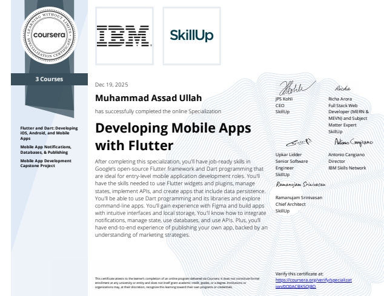
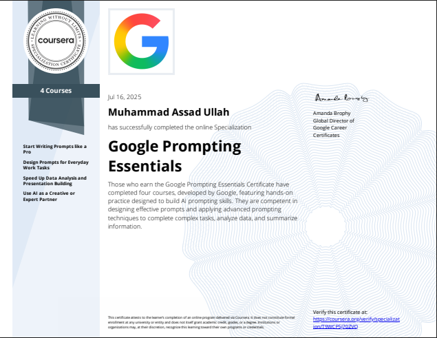
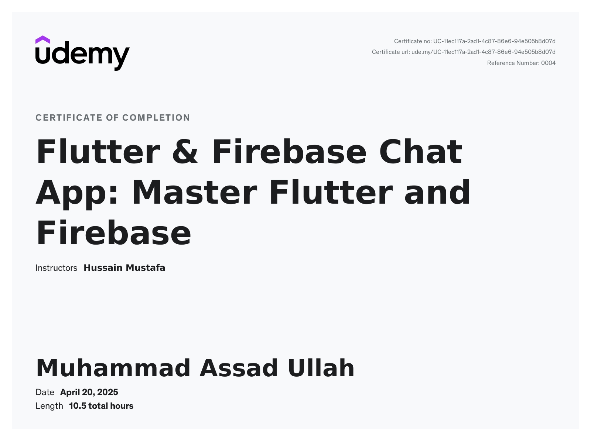
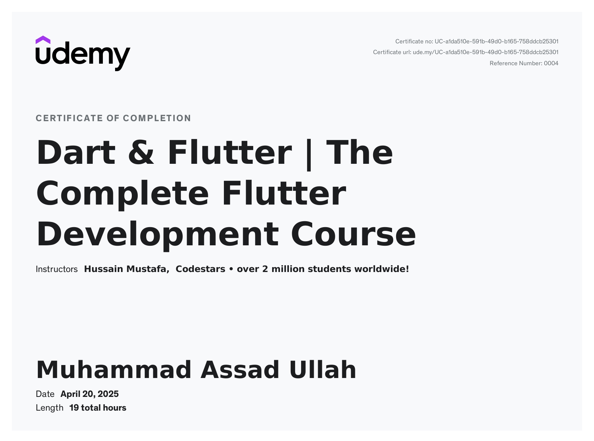

> [!NOTE]
> "If you don't like your destiny, don't accept it. Instead, have the courage to change it the way you want it to be." — **Naruto Uzumaki**
> 
> "People's dreams... have no end!" — Marshall D. Teach **One Piece**
 

 

## About Me

💙 **Flutter Developer** from Pakistan, specializing in offline-first & on-device AI mobile apps

🎓 **Final-year** BS Computer Science @ UET Taxila

📦 **Author** of 2 published Flutter packages on pub.dev

🌱 Active Flutter **open-source contributor**

🏆 7x **Hackathon Winner**

🚀 **Open to** Flutter internships, remote roles, and freelance work

⭐ **Goal:** become one of the top Flutter open-source contributors

 

## Open Source

**This is the centerpiece, not a footnote.**

## 📦 Merged Pull Requests

<b>📌 Recent PRs (6 shown)</b>

| Repository | PR | Status |
|---|---|---|
| [lichess-org/mobile](https://github.com/lichess-org/mobile) | [#3448](https://github.com/lichess-org/mobile/pull/3448) — Add flip board button to puzzle screen (#3372) | ✅ Merged |
| [Amayyas/SkyPulse](https://github.com/Amayyas/SkyPulse) | [#41](https://github.com/Amayyas/SkyPulse/pull/41) — fix deprecation warnings | ✅ Merged |
| [Amayyas/SkyPulse](https://github.com/Amayyas/SkyPulse) | [#59](https://github.com/Amayyas/SkyPulse/pull/59) — remove unused dependency | ✅ Merged |
| [Amayyas/SkyPulse](https://github.com/Amayyas/SkyPulse) | [#60](https://github.com/Amayyas/SkyPulse/pull/60) — fix wind speed display bug | ✅ Merged |
| [Amayyas/SkyPulse](https://github.com/Amayyas/SkyPulse) | [#62](https://github.com/Amayyas/SkyPulse/pull/62) — metric/imperial unit toggle | ✅ Merged |
| [willskymaker/master_aid](https://github.com/willskymaker/master_aid) | [#48](https://github.com/willskymaker/master_aid/pull/48) — unit tests for core logic | ✅ Merged |

<b>📜 Show older PRs (3 more)</b>

| Repository | PR | Status |
|---|---|---|
| [willskymaker/master_aid](https://github.com/willskymaker/master_aid) | [#76](https://github.com/willskymaker/master_aid/pull/76) — homebrew monster creator + CR estimation | ✅ Merged |
| [willskymaker/master_aid](https://github.com/willskymaker/master_aid) | [#101](https://github.com/willskymaker/master_aid/pull/101) — CR filter for combat tracker | ✅ Merged |
| [willskymaker/master_aid](https://github.com/willskymaker/master_aid) | [#111](https://github.com/willskymaker/master_aid/pull/111) — extended CR filtering | ✅ Merged |

 

## Package Library

<table width="100%">
<tr>
<td width="50%" valign="top">

**[offline_sync_flutter](https://github.com/assassinaj602/offline_sync_flutter)**
Flutter · Dart · Hive · SQLite

Offline-first API sync engine for Flutter queues requests locally when the device is offline, auto-syncs the moment connectivity returns, with configurable retry policies and conflict resolution (serverWins / localWins / manual). Ships with reactive widgets (`SyncIndicator`, `PendingRequestsBadge`, `SyncStatusBanner`) for surfacing sync state in the UI.

</td>
<td width="50%" valign="top">

**[flutter_form_guard](https://github.com/assassinaj602/flutter_form_guard)**
Flutter · Dart

A robust, "smart" form management package for Flutter that handles validation, auto-saving (draft restoration), and analytics out of the box.

SmartFormGuard decouples your form logic from the UI, ensuring your forms are responsive, persistent, and insightful. It is designed to be architecture-agnostic, working seamlessly with Provider, Riverpod, Bloc, or vanilla setState.

</td>
</tr>
</table>
 

### Stats & Streak

  

  

### Contribution Graph

  

## Flutter Tech

 

## Currently Working On

- Contributing to **Flutter open source**
- Picking up **issues** on Flutter packages
- **Publishing** more Flutter packages
- **Building** Material 3 apps
- Sharpening **Clean Architecture** practice

 

## Achievements

- 🏆 7x Hackathon Winner
- 📦 Published Flutter Packages on pub.dev
- 🌱 Active Flutter Open Source Contributor
- 💻 Production Flutter Apps Shipped
- 🌐 Freelance Flutter Developer

 

## Certifications

<table width="100%">
  <tr>
    <td width="65%" valign="top">
      <h3>Flutter and Dart: Developing iOS, Android, and Mobile Apps</h3>
      
<b>Issuer:</b> IBM (Coursera)

      
<b>Description:</b> An end-to-end professional course covering the full Flutter development lifecycle building responsive UI layouts, navigation and routing, state management, and platform-specific integrations for both iOS and Android. Concludes with app testing strategies and a real deployment workflow.

      
    </td>
    <td width="35%" align="center" valign="middle">
      
    </td>
  </tr>
</table>

<table width="100%">
  <tr>
    <td width="65%" valign="top">
      <h3>Google Prompting Essentials Specialization</h3>
      
<b>Issuer:</b> Google (Coursera)

      
<b>Description:</b> A hands-on specialization in prompt engineering across multiple LLM providers, covering how to structure prompts for reliability, apply safety and evaluation practices, and design prompts that generalize across different models rather than overfitting to one.

      
    </td>
    <td width="35%" align="center" valign="middle">
      
    </td>
  </tr>
</table>

<table width="100%">
  <tr>
    <td width="65%" valign="top">
      <h3>Master Flutter and Firebase</h3>
      
<b>Issuer:</b> Udemy

      
<b>Description:</b> A production-focused course on integrating Firebase into Flutter apps covering Auth flows, real-time Firestore data, and backend best practices for building apps that are ready to ship rather than just tutorial demos.

      
    </td>
    <td width="35%" align="center" valign="middle">
      
    </td>
  </tr>
</table>

<table width="100%">
  <tr>
    <td width="65%" valign="top">
      <h3>Dart & Flutter: The Complete Flutter Development Course</h3>
      
<b>Issuer:</b> Udemy

      
<b>Description:</b> A comprehensive foundation course covering Dart language fundamentals and core Flutter concepts widgets, navigation, state management, and platform integration, building the base skill set used across all later, more advanced Flutter work.

      
    </td>
    <td width="35%" align="center" valign="middle">
      
    </td>
  </tr>
</table>

 

## Connect

  
  
  
  

 

 

 

